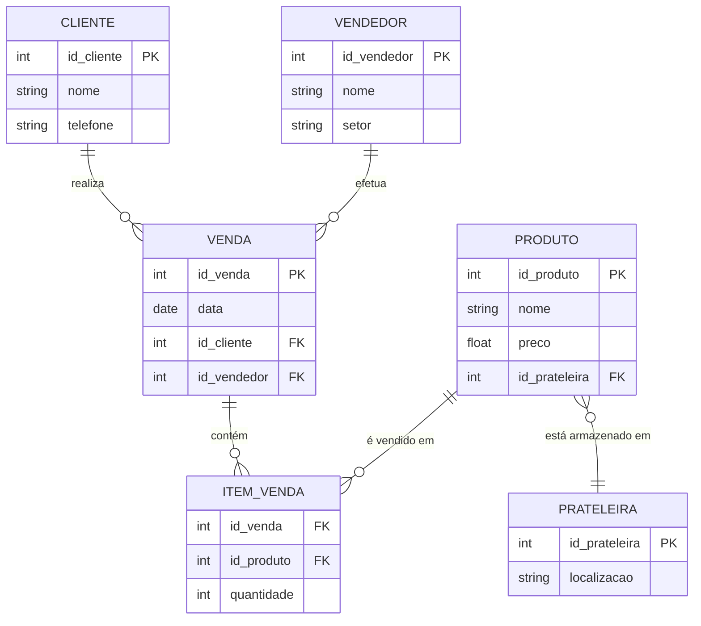

# Exercicio indentificar entidades
### Deseja-se construir um banco de dados para um sistema de venda. em cada venda são vendidos varios produtors em um determinado produto pode aparecer em diferentes vendas. cada venda é efetuada por um vendedor para um determinado cliente. um produto esta armazenado um uma prateleira.

                +------------------+
                |     Cliente      |
                | ---------------- |
                | *id_cliente*     |
                | Nome             |
                | Telefone         |
                +------------------+
                        |
                        | 1..n
                        v
                +------------------+
                |      Venda       |
                | ---------------- |
                | *id_venda*       |
                | Data             |
                | id_cliente (FK)  |
                | id_vendedor (FK) |
                +------------------+
                        | 
                        | 1..n
                        v
                +------------------+  0..n
                |   Item_Venda     |-----------------------+
                | ---------------- |                       |
                | *id_venda (FK)*  |                       |
                | *id_produto (FK)*|                       |
                | Quantidade       |                       |
                +------------------+                       |
                        |                                  |
                        | 1..n                             |
                        v                                  |
                +------------------+                       |
                |     Produto      |                       |
                | ---------------- |                       |
                | *id_produto*     |                       |
                | Nome             |                       |
                | Preço            |                       |
                | id_prateleira FK |-----------------------+
                +------------------+
                        |
                        | 1..1
                        v
                +------------------+
                |   Prateleira     |
                | ---------------- |
                | *id_prateleira*  |
                | Localização      |
                +------------------+

                +------------------+
                |    Vendedor      |
                | ---------------- |
                | *id_vendedor*    |
                | Nome             |
                | Setor            |
                +------------------+

