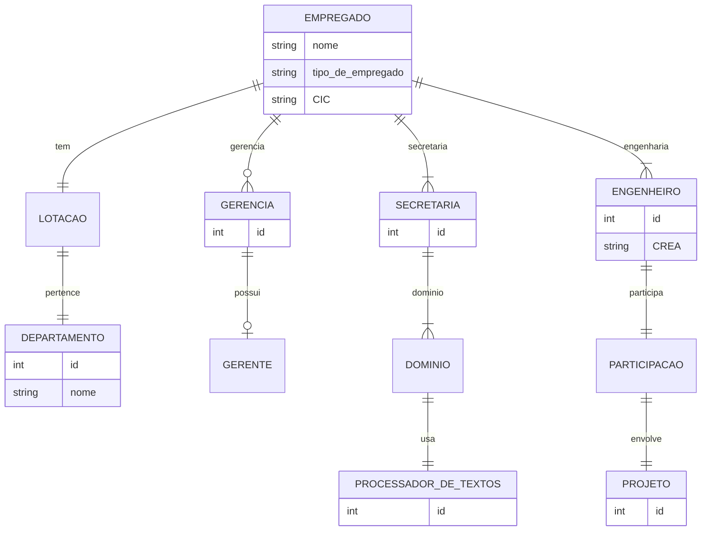
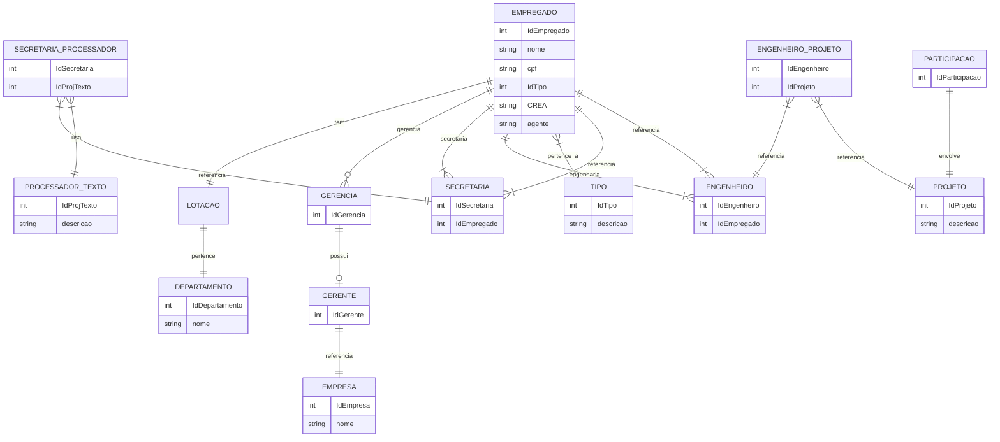
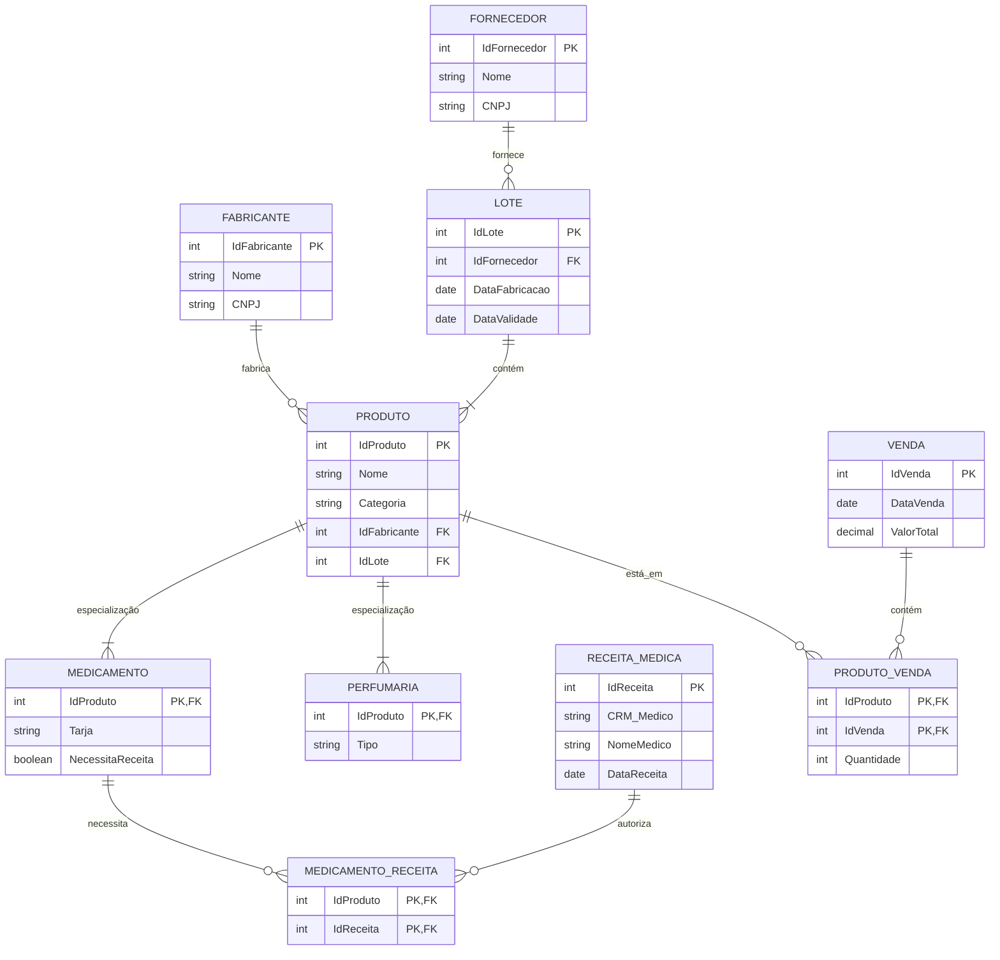

- Departamento(idDepartamento,nome)
- ProcessadirTexto(IdProjTexto,descrição)
- Projeto(IdProjeto,descrição)
- Tipo(IdTipo, Descrição)
- Empregado(IdEmpregado, nome,cpf, |tipo|,CREA-NULL,agente-Null) tipo referencia tabela tipo(criar tabela nova)
GERENTEREFERENCIA EMRESSAS
-Secretaria_ProcessadorTextos(Idsecretaria,processador)
secretaria referencia empregado
Engenheiro-projeto (engenheiro referencia empregado -> projeto referencia projeto)




Departamento(idDepartamento,nome)
Ciencia de computação
Sistema de informação
Jogos digitais

ProcesssadorTexto(idprocesssador,descrição)
10 word MS
20 star Office
30 Libre Office
40 Libre Office

projeto(idProjeto,descrição)
100 longevos
102 raquetada dos amigos

tipo(idTipo,descrição)
1001 Gerente
1002 secretaria
1003 engenheiro

Empregrado*(idEmpregdo,nome,cpf,crea,gerente)
1 Alexandre,cpf1212,1001,NULL,NULL
2 Pedro,cpf32323,1003, crea123123, 1



---

## **Modelo Lógico Relacional**

### **Tabelas e Relacionamentos**

#### **FORNECEDOR**
- **PK** IdFornecedor *(INT, AUTO_INCREMENT, NOT NULL)*
- Nome *(VARCHAR(255), NOT NULL)*
- CNPJ *(VARCHAR(20), UNIQUE, NOT NULL)*

#### **FABRICANTE**
- **PK** IdFabricante *(INT, AUTO_INCREMENT, NOT NULL)*
- Nome *(VARCHAR(255), NOT NULL)*
- CNPJ *(VARCHAR(20), UNIQUE, NOT NULL)*

#### **LOTE**
- **PK** IdLote *(INT, AUTO_INCREMENT, NOT NULL)*
- **FK** IdFornecedor *(INT, NOT NULL, referencia FORNECEDOR(IdFornecedor))*
- DataFabricacao *(DATE, NOT NULL)*
- DataValidade *(DATE, NOT NULL)*

#### **PRODUTO**
- **PK** IdProduto *(INT, AUTO_INCREMENT, NOT NULL)*
- Nome *(VARCHAR(255), NOT NULL)*
- Categoria *(ENUM('MEDICAMENTO', 'PERFUMARIA'), NOT NULL)*
- **FK** IdFabricante *(INT, NOT NULL, referencia FABRICANTE(IdFabricante))*
- **FK** IdLote *(INT, NOT NULL, referencia LOTE(IdLote))*

#### **MEDICAMENTO** (Especialização de PRODUTO)
- **PK/FK** IdProduto *(INT, NOT NULL, referencia PRODUTO(IdProduto))*
- Tarja *(ENUM('Branca', 'Vermelha', 'Preta'), NOT NULL)*
- NecessitaReceita *(BOOLEAN, NOT NULL)*

#### **PERFUMARIA** (Especialização de PRODUTO)
- **PK/FK** IdProduto *(INT, NOT NULL, referencia PRODUTO(IdProduto))*
- Tipo *(VARCHAR(255), NOT NULL)*

#### **RECEITA_MEDICA**
- **PK** IdReceita *(INT, AUTO_INCREMENT, NOT NULL)*
- CRM_Medico *(VARCHAR(20), NOT NULL)*
- NomeMedico *(VARCHAR(255), NOT NULL)*
- DataReceita *(DATE, NOT NULL)*

#### **VENDA**
- **PK** IdVenda *(INT, AUTO_INCREMENT, NOT NULL)*
- DataVenda *(DATE, NOT NULL)*
- ValorTotal *(DECIMAL(10,2), NOT NULL)*

#### **PRODUTO_VENDA** (Relacionamento entre PRODUTO e VENDA, representando "Venda" de múltiplos produtos)
- **PK** IdProduto *(INT, NOT NULL, referencia PRODUTO(IdProduto))*
- **PK** IdVenda *(INT, NOT NULL, referencia VENDA(IdVenda))*
- Quantidade *(INT, NOT NULL)*

#### **MEDICAMENTO_RECEITA** (Relacionamento entre MEDICAMENTO e RECEITA_MEDICA)
- **PK** IdProduto *(INT, NOT NULL, referencia MEDICAMENTO(IdProduto))*
- **PK** IdReceita *(INT, NOT NULL, referencia RECEITA_MEDICA(IdReceita))*

---

### **Explicação da Modelagem**
1. **Fornecedores e Fabricantes** um fornecedor pode vender lotes | um fabricante é responsável pela produção.
2. **Produtos** pertencem a um lote e são fabricados por um fabricante.
3. **Medicamentos e Perfumaria** são especializações da entidade **Produto** (generalização/especialização).
4. **Receita Médica** é necessária para a venda de medicamentos controlados.
5. **Vendas** podem incluir vários produtos, por isso existe a tabela intermediária **PRODUTO_VENDA**.
6. **Medicamentos que precisam de receita** são relacionados diretamente à **Receita Médica** através de **MEDICAMENTO_RECEITA**.

---

### **Tabelas e Relacionamentos**

#### **FORNECEDOR**  
```sql
CREATE TABLE FORNECEDOR (
    IdFornecedor INT PRIMARY KEY,
    Nome VARCHAR(255) NOT NULL,
    CNPJ VARCHAR(20) UNIQUE NOT NULL
);
```

#### **FABRICANTE**  
```sql
CREATE TABLE FABRICANTE (
    IdFabricante INT PRIMARY KEY,
    Nome VARCHAR(255) NOT NULL,
    CNPJ VARCHAR(20) UNIQUE NOT NULL
);
```

#### **LOTE**  
```sql
CREATE TABLE LOTE (
    IdLote INT PRIMARY KEY,
    IdFornecedor INT NOT NULL,
    DataFabricacao DATE NOT NULL,
    DataValidade DATE NOT NULL,
    FOREIGN KEY (IdFornecedor) REFERENCES FORNECEDOR(IdFornecedor)
);
```

#### **PRODUTO**  
```sql
CREATE TABLE PRODUTO (
    IdProduto INT PRIMARY KEY,
    Nome VARCHAR(255) NOT NULL,
    Categoria ENUM('MEDICAMENTO', 'PERFUMARIA') NOT NULL,
    IdFabricante INT NOT NULL,
    IdLote INT NOT NULL,
    FOREIGN KEY (IdFabricante) REFERENCES FABRICANTE(IdFabricante),
    FOREIGN KEY (IdLote) REFERENCES LOTE(IdLote)
);
```

#### **MEDICAMENTO**  
```sql
CREATE TABLE MEDICAMENTO (
    IdProduto INT PRIMARY KEY,
    Tarja ENUM('Branca', 'Vermelha', 'Preta') NOT NULL,
    NecessitaReceita BOOLEAN NOT NULL,
    FOREIGN KEY (IdProduto) REFERENCES PRODUTO(IdProduto)
);
```

#### **PERFUMARIA**  
```sql
CREATE TABLE PERFUMARIA (
    IdProduto INT PRIMARY KEY,
    Tipo VARCHAR(255) NOT NULL,
    FOREIGN KEY (IdProduto) REFERENCES PRODUTO(IdProduto)
);
```

#### **RECEITA_MEDICA**  
```sql
CREATE TABLE RECEITA_MEDICA (
    IdReceita INT PRIMARY KEY,
    CRM_Medico VARCHAR(20) NOT NULL,
    NomeMedico VARCHAR(255) NOT NULL,
    DataReceita DATE NOT NULL
);
```

#### **VENDA**  
```sql
CREATE TABLE VENDA (
    IdVenda INT PRIMARY KEY,
    DataVenda DATE NOT NULL,
    ValorTotal DECIMAL(10,2) NOT NULL
);
```

#### **PRODUTO_VENDA** (Relacionamento entre PRODUTO e VENDA)  
```sql
CREATE TABLE PRODUTO_VENDA (
    IdProduto INT NOT NULL,
    IdVenda INT NOT NULL,
    Quantidade INT NOT NULL,
    PRIMARY KEY (IdProduto, IdVenda),
    FOREIGN KEY (IdProduto) REFERENCES PRODUTO(IdProduto),
    FOREIGN KEY (IdVenda) REFERENCES VENDA(IdVenda)
);
```

#### **MEDICAMENTO_RECEITA** (Relacionamento entre MEDICAMENTO e RECEITA_MEDICA)  
```sql
CREATE TABLE MEDICAMENTO_RECEITA (
    IdProduto INT NOT NULL,
    IdReceita INT NOT NULL,
    PRIMARY KEY (IdProduto, IdReceita),
    FOREIGN KEY (IdProduto) REFERENCES MEDICAMENTO(IdProduto),
    FOREIGN KEY (IdReceita) REFERENCES RECEITA_MEDICA(IdReceita)
);
```

---