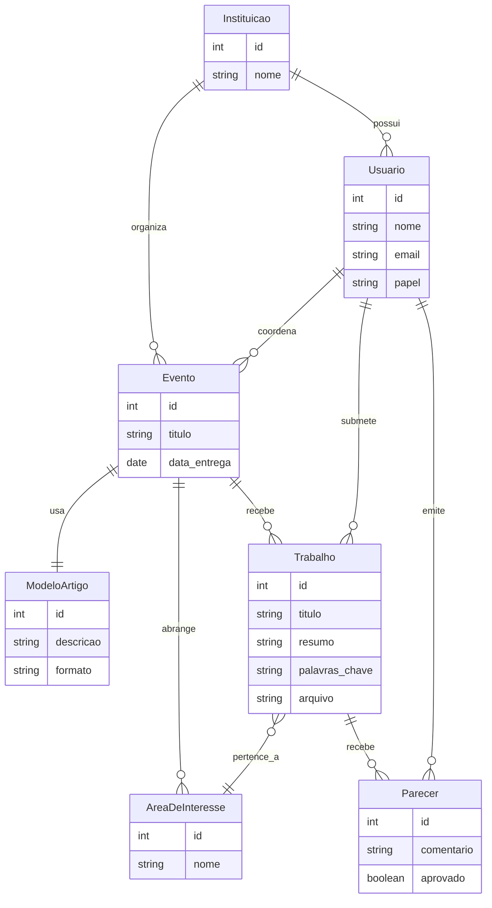

- Modelagem Fisica
    - tipos de atributos
    - restrições
        - atributos
        - carniadinalidade
        - duplicidade - automatica ao se definir uma chave primaria
        - dependencia - chave estrangeira
            - delete on: cascate or restrict
    - Complexidade
    - Restrições

Sistema de avaliação de artigos
sistema web
cadastrar 
gerennciar eventos cientificos 
separados por instituições de ensino
evento quando gerado, um cordenador autoriza a submissao de trabalho
trabalho deverá ter titulo, autor(que devem estar no sistema),area de interesse(areas de interesse sao gerenciadas tambem pelo sistema), resumo, palavras chave, arquivo contendo artigo
sistema devem gerenciar modelos de artigos, associados a um evento, um evento tem, um cordenador, um titulo, uma data de entrega de trabalho, modelo de artigo, uma qvez que uma submissao de trabalho é cadastrada, o corndenador do evento precisa delegar 2 avaliadores, em que os avaliadores escrevem um parecer e infromam sim ou nao ao attigo , ou seja se ele foi ou nao aceito para a publicação


---

### 🔄 **Diagrama de Fluxo em Mermaid**


---
```mermaid


```

```
-- Tabela: Instituicao
CREATE TABLE instituicao (
    id SERIAL PRIMARY KEY,
    nome VARCHAR(255) NOT NULL
);

-- Tabela: Usuario
CREATE TABLE usuario (
    id SERIAL PRIMARY KEY,
    nome VARCHAR(255) NOT NULL,
    email VARCHAR(255) UNIQUE NOT NULL,
    papel VARCHAR(50) NOT NULL, -- autor, avaliador, coordenador
    id_instituicao INT REFERENCES instituicao(id)
);

-- Tabela: Modelo de Artigo
CREATE TABLE modelo_artigo (
    id SERIAL PRIMARY KEY,
    descricao TEXT,
    formato VARCHAR(100)
);

-- Tabela: Evento
CREATE TABLE evento (
    id SERIAL PRIMARY KEY,
    titulo VARCHAR(255) NOT NULL,
    data_entrega DATE NOT NULL,
    id_instituicao INT REFERENCES instituicao(id),
    id_modelo INT REFERENCES modelo_artigo(id),
    id_coordenador INT REFERENCES usuario(id)
);

-- Tabela: Area de Interesse
CREATE TABLE area_de_interesse (
    id SERIAL PRIMARY KEY,
    nome VARCHAR(100) NOT NULL
);

-- Tabela: Trabalho
CREATE TABLE trabalho (
    id SERIAL PRIMARY KEY,
    titulo VARCHAR(255) NOT NULL,
    resumo TEXT,
    palavras_chave TEXT,
    arquivo TEXT, -- poderia ser caminho ou base64
    id_autor INT REFERENCES usuario(id),
    id_evento INT REFERENCES evento(id),
    id_area INT REFERENCES area_de_interesse(id)
);

-- Tabela: Parecer
CREATE TABLE parecer (
    id SERIAL PRIMARY KEY,
    comentario TEXT,
    aprovado BOOLEAN NOT NULL,
    id_avaliador INT REFERENCES usuario(id),
    id_trabalho INT REFERENCES trabalho(id)
);
```

### 📝 Componentes do sistema destacados:

- **Cadastro de usuários/autores**
- **Gestão de instituições e eventos científicos/modelos**
- **Autorização de submissão por coordenadores**
- **Submissão com metadados e arquivo**
- **Avaliação por dois avaliadores**
- **Gerenciamento de áreas de interesse**
- **Modelos de artigos também são gerenciáveis**
- **Decisão final sobre aceitação do artigo**


