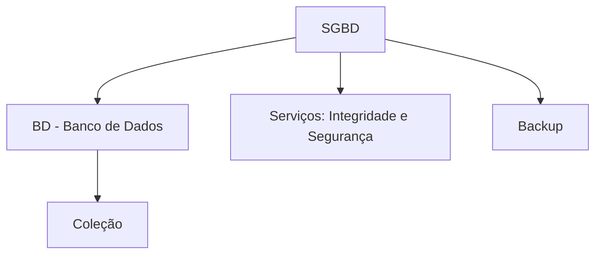
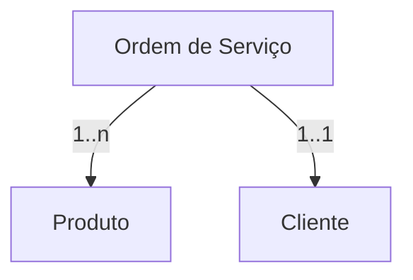
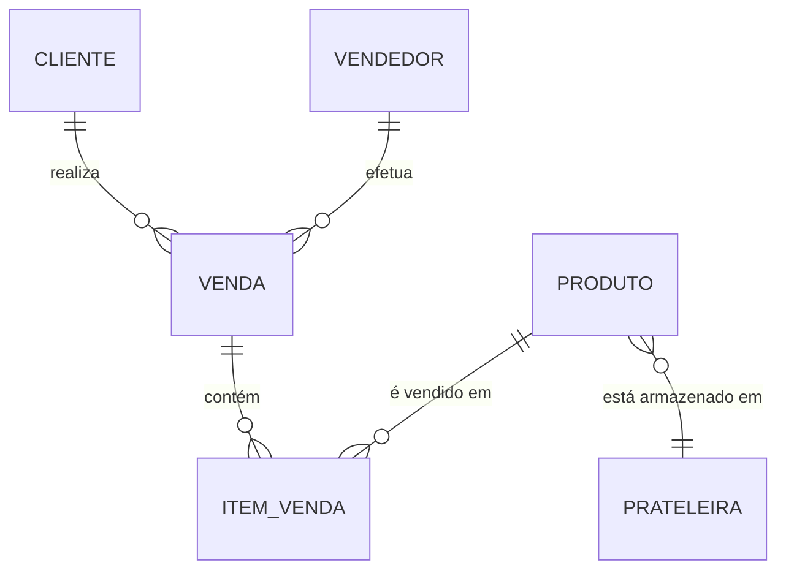
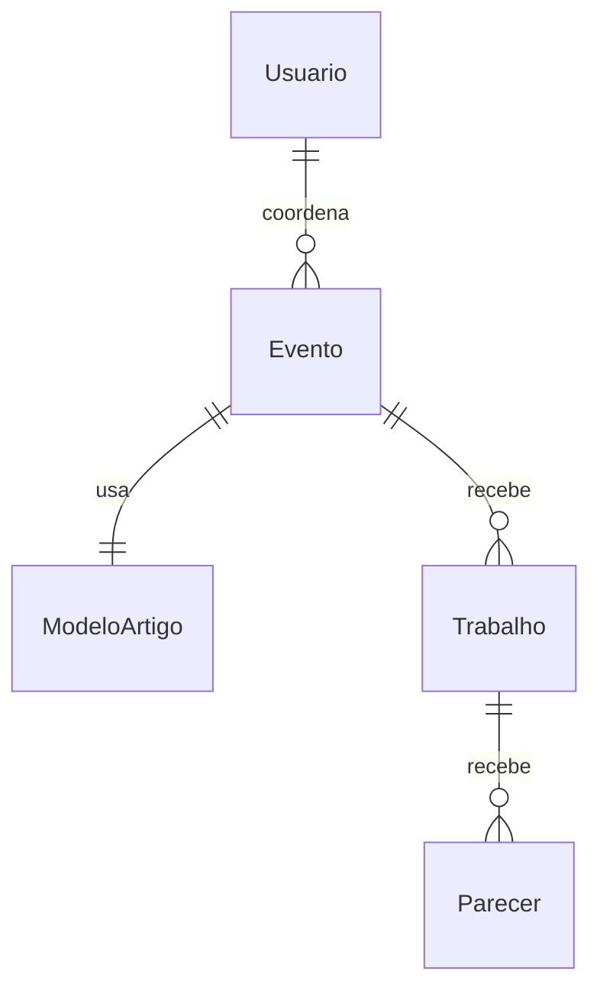

### 📚 **Referência Principal**
HEUSER, C. A. *Projeto de Banco de Dados*. Porto Alegre: Sagra Luzzatto, 2001.  
[Catálogo de bibliotecas: https://www.worldcat.org/title/47071640](https://www.worldcat.org/title/47071640)

---

## 📌 **1. Conceitos Básicos**

- **Banco de Dados (BD)**: Coleção estruturada de dados relacionados.
- **Sistema Gerenciador de Banco de Dados (SGBD)**: Software que controla o acesso, manipulação e segurança dos dados.
- **Dados x Informação**: Dados são brutos, informação é tratada e interpretada.

### Representação ASCII:

```plaintext
      +----------------------+
      |       SGBD          |
      |  +--------------+   |
      |  |     BD       |   |
      |  |  "coleção"   |   |
      |  +--------------+   |
      | Serviços:           |
      | - Integridade       |
      | - Segurança         |
      |                      |
      | BACKUP               |
      +----------------------+
```

### Diagrama Mermaid:



---

## 📌 **2. Modelos de Banco de Dados**

- **Hierárquico**: estrutura em árvore.
- **Rede**: estrutura em grafo, relacionamentos complexos.
- **Relacional**: base em tabelas (modelo mais usado).

---

## 📌 **3. Modelo Relacional**

### Elementos:
- **Relação** (Tabela)
- **Tupla** (Linha)
- **Atributo** (Coluna)
- **Chave primária** e **Chave estrangeira**

### Fases de Modelagem:
1. **Modelo Conceitual** (Ex: Diagrama ER)
2. **Modelo Lógico** (Transformado em tabelas relacionais)
3. **Modelo Físico** (Implementação no SGBD)

---

## 📌 **4. Exemplo Prático – Modelo de Ordem de Serviço (OS)**

### ASCII:

```plaintext
              +----------------+
              |      O.S.      |
              | -------------- |
              | *Número OS*    |1..n
              | *Descrição*    |---------------------+                    
              +----------------+                     |
                      | 0..n                         |
                      |                              |
                      v 1..n                         |
              +----------------+                     |
              |    Produto     |                     |
              +----------------+                     |
                                                     |
              +----------------+---------------------|
              |    Cliente     |1..1
              +----------------+
```

### Mermaid:



---

## 📌 **5. Modelagem de Sistema de Venda**

### ASCII:

(Simplificado – Venda, Cliente, Produto, Item_Venda, Prateleira, Vendedor)

### Diagrama Mermaid:



---

## 📌 **6. Modelagem Conceitual x Lógica x Física**

| Etapa        | Representação                                  |
|--------------|------------------------------------------------|
| Conceitual   | Entidades, atributos, relacionamentos (ER)     |
| Lógica       | Tabelas, colunas, chaves                       |
| Física       | Tipos SQL, índices, otimizações, segurança     |

---

## 📌 **7. Exemplos Avançados – Modelos para Farmácia e Avaliação de Artigos**

Você incluiu exemplos **detalhados de domínio**, como:

### 🧪 Farmácia (Medicamentos, Receitas, Produtos, Fornecedores)

- Especializações (Produto → Medicamento/Perfumaria)
- Relacionamentos muitos-para-muitos (Produto-Venda, Medicamento-Receita)

### 🎓 Sistema Web de Avaliação de Artigos

- Instituições, Eventos, Artigos, Avaliadores
- Fluxo de submissão → delegação → parecer

Diagrama principal:



---

## 📌 **8. Conceitos Complementares**

- **Entidade** = objeto real/mundo real no modelo ER
- **Categoria/Generalização/Especialização** = abstrações para reuso e estrutura
- **Dependência referencial**: uso de chaves estrangeiras
- **Restrições**: integridade, cardinalidade, duplicidade

---

## 📌 **9. Modelagem e Projeto: Diferença**

| Termo     | Definição |
|-----------|-----------|
| **Modelar** | Abstrair: representar estrutura |
| **Projetar** | Implementar: decidir tecnologias, estrutura física |

---

## 🧠 **Sugestão de Revisão para Prova**

- Estude a **transformação de modelo conceitual para relacional**.
- Refaça os **diagramas Mermaid ou ER** manualmente para memorizar.
- Revise conceitos como: **chave primária**, **chave estrangeira**, **normalização**.
- Releia os modelos fornecidos: **farmácia, sistema de venda, obras, artigos**.
